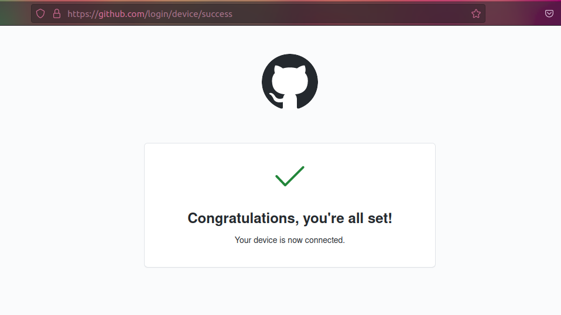

# Welcome to CleanCodeWorkshop :checkered_flag:

<span style="width:100%">[](https://forthebadge.com)
[](https://forthebadge.com)
[](https://forthebadge.com)
</span>

<span style="width:100%">[](https://forthebadge.com)
[](https://forthebadge.com)
[](https://forthebadge.com)
</span>

## About the Workshop 


We are here with a workshop which aims at providing you an understanding of Clean Code via examples taken from various sources. This workshop will help you differentiate between "clean" and "dirty" code.

We will get our hands dirty by diving into some "dirty" code snippets and "cleaning" them with our learning. We will also see why some approaches are better than the others and try to develop a better understanding of all the principles of "Clean Code".

## Takeaways from this Workshop

* Better understanding on clean coding practices.
* Choose better approach when developing.
* Ability to differentiate between different approaches.
* Fun!


## Structure of the Repository

* This repository contains multiple branches named according to group numbers. Ex- `group1`, `group2` etc.
* All the branches contain a set of similar probelms.
* Problems are set with increasing level of complexity and difficulty. `Problem1` being the easiest.(You may wanna start here😉)

## Steps to participate :boom:

#### 1) `Fork` this repository.(Incase facing issue, follow this documentation) and `clone` it.
#### 2) Checkout to your branch. (According to `group` you belong).
#### 3) Refactor the problems in the same place.
#### 4) Create a `PR` [ Pull Request ] targeted to the same branch.
#### 5) You have successfully participated.
#### 6) Sit back and relax.

## Methods of Participation

* Using `Web UI`
* Using `GitHub CLI`
*   For Mac Users
*   For Windows
*   For Linux

## Pariticipation via `Web UI`

*

## Pariticipation via `GitHub CLI`: For Linux

For all the nerds who want to learn and explore more of `GitHub CLI` please follow along. If you have already installed `gh cli` you can skip to the second section.

Installing `gh cli` [link](https://github.com/cli/cli/blob/trunk/docs/install_linux.md)

```bash 

curl -fsSL https://cli.github.com/packages/githubcli-archive-keyring.gpg | sudo gpg --dearmor -o /usr/share/keyrings/githubcli-archive-keyring.gpg

echo "deb [arch=$(dpkg --print-architecture) signed-by=/usr/share/keyrings/githubcli-archive-keyring.gpg] https://cli.github.com/packages stable main" | sudo tee /etc/apt/sources.list.d/github-cli.list > /dev/null

sudo apt update

sudo apt install gh

gh auth login
```



After successful installation of `gh cli`, it is now time to start the task at hand. 

```bash
# Clone the repo 
git clone https://github.com/Imsurajkr/cleancodeworkshop.git

# Navigate into the root of the repo.
cd cleancodeworkshop

# Fork the repo.
gh repo fork 

parentBranch={GroupName} # Replace {GroupName} with your group 
candidateName={MemberName} # Replace {MemberName} with your name (no spaces recommended)
branchName="$parentBranch-$candidateName"
git checkout -b $branchName

# All set! add your magic...
# When done
git pull 
git add <FilesChanged> 
git commit -m "Customized Message"
git push 

# Raise PR
gh pr create --title "I did some changes" --body "And it works"

# All the best :-)
```


